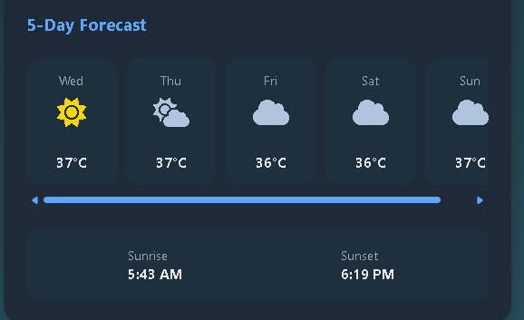

# 🌤️ Weather Insight Web

[](https://github.com/eswarsamanthula/Weather-Insight-Web/stargazers)
[](https://github.com/eswarsamanthula/Weather-Insight-Web/network/members)
[](https://github.com/eswarsamanthula/Weather-Insight-Web/issues)
[](https://github.com/eswarsamanthula/Weather-Insight-Web/blob/main/LICENSE)

A sleek, modern weather app built with vanilla JavaScript and Vite that delivers real-time weather data, geolocation support, dynamic backgrounds, and a responsive interface. The app integrates the OpenWeatherMap API and prioritizes both functionality and design.

🔗 **Live Demo:** [Weather-Insight-Wed](https://weather-insight-wed.netlify.app/)

---

## ✨ Features

- 📍 **Geolocation** support: Get the weather for your current location instantly.
- 🔍 **City search**: Enter any city to fetch real-time weather data.
- 🌈 **Dynamic backgrounds**: Visuals change based on weather conditions.
- 🔁 **Retry mechanism**: Easily retry failed API calls.
- 🌡️ Display of temperature, humidity, wind speed, and conditions.
- 📱 Fully **responsive UI** for mobile and desktop.
- ⏳ **5-day forecast** section (in progress).
- 🔐 Secure **API key management** via `.env`.

---

## 📸 Screenshots

### 🌇 Search by City


### 📍 Location-based Weather


### ❌ Error + Retry


### 📅 5-Day Forecast


---

## 🗺️ Roadmap

- ✅ Geolocation-based fetch
- ✅ City input support
- ✅ Retry button for errors
- ✅ Dynamic visual backgrounds
- ✅ API key security with `.env`
- ⏳ 5-day forecast UI and icons
- ⏳ Hourly forecast toggle
- ⏳ °C / °F temperature unit switch
- ⏳ Dark/light theme toggle 🌙/🌞

---

## 🛠 Tech Stack

- **Frontend**: HTML5, CSS3, Vanilla JavaScript
- **Bundler**: Vite
- **API**: OpenWeatherMap API
- **Hosting**: GitHub Pages

---

## 📁 Project Structure

```
Weather-Insight-Web/
├── index.html
├── style.css
├── script.js
├── screenshots/
│   ├── current-weather-light.png
│   ├── current-weather-dark.png
│   ├── error.png
│   └── forecast.png
└── README.md
```

---

## 🚀 Getting Started

### 1. Clone the repository

```bash
git clone https://github.com/eswarsamanthula/Weather-Insight-Web.git
cd Weather-Insight-Web
```

### 2. Install dependencies

```bash
npm install
```

### 3. Start the development server

```bash
npm run dev
```

---

## 🔐 API Key Setup

To secure your OpenWeather API key during local development:

1. Create a `.env` file in the root directory.
2. Add the following line:

   ```env
   VITE_OPENWEATHER_API_KEY=your_api_key_here
   ```

3. Make sure `.env` is listed in `.gitignore` (already configured).
4. Restart the dev server if it’s running.

🔒 **Note**: Never commit your `.env` file to GitHub. When deploying, configure your hosting provider to use the environment variable.

---

## 🙌 Contributing

Contributions are welcome! Feel free to fork the repo, suggest features, report bugs, or submit pull requests.

---

## 📬 Contact

Created with ❤️ by **Eswar Samanthula**  
📧 [eswarsamanthulas@gmail.com](mailto:eswarsamanthulas@gmail.com)

---

## 📄 License

This project is licensed under the [MIT License](LICENSE).
