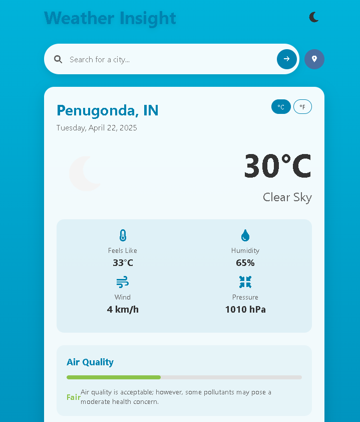

# 🌤️ Weather App

[](https://github.com/eswarsamanthula/Weather-App/stargazers)
[](https://github.com/eswarsamanthula/Weather-App/network/members)
[](https://github.com/eswarsamanthula/Weather-App/issues)
[](https://github.com/eswarsamanthula/Weather-App/blob/main/LICENSE)

A sleek weather forecast app that fetches real-time weather data using the OpenWeatherMap API. Includes geolocation, dynamic backgrounds, retry options, and a user-friendly interface.

🔗 **Live Demo:** [eswarsamanthula.github.io/Weather-App](https://eswarsamanthula.github.io/Weather-App)

---

## ✨ Features

- 🌍 Fetch weather based on **geolocation** or **city search**
- 🌤 Dynamic **backgrounds** based on weather conditions
- 🔁 Retry button for failed API requests
- 🌡 Displays temperature, humidity, wind, and description
- 📱 Fully responsive design
- ⏳ 5-day forecast (in-progress)
- 🔐 API key hidden using `.env` in local development

---

## 📸 Screenshots

### 🔍 Search by City


### 📍 Weather by Location


### ❌ Retry on Error


### 📅 forecast


---

## 📅 Roadmap

- [x] Geolocation-based weather fetch
- [x] Manual city input search
- [x] Retry button for API failure
- [x] Dynamic backgrounds
- [x] API key protection via `.env`
- [ ] 5-day forecast with weather icons ⛅
- [ ] Hourly forecast toggle
- [ ] Unit switch (°C / °F)
- [ ] Dark/light theme toggle 🌙🌞

---

## 🛠️ Tech Stack

- HTML5
- CSS3
- JavaScript (Vanilla)
- OpenWeatherMap API
- GitHub Pages (for hosting)

---

## 📂 Project Structure

📦 Weather-App ┣ 📜 index.html ┣ 📜 style.css ┣ 📜 script.js ┣ 📁 screenshots/ ┃ ┣ 📜 README.md


---

## 🚀 Getting Started

### Clone the repository

```bash
git clone https://github.com/eswarsamanthula/Weather-App.git
cd Weather-App
```

🙌 Contributing
Feel free to fork this repo and submit pull requests with improvements, bug fixes, or feature additions!

📬 Contact
Created by Eswar Samanthula
📧 Email: eswarsamanthulas@gmail.com
=======
# Weather App - React + Vite

This template provides a minimal setup to get React working in Vite with HMR and some ESLint rules.

Currently, two official plugins are available:

- [@vitejs/plugin-react](https://github.com/vitejs/vite-plugin-react/blob/main/packages/plugin-react) uses [Babel](https://babeljs.io/) for Fast Refresh
- [@vitejs/plugin-react-swc](https://github.com/vitejs/vite-plugin-react/blob/main/packages/plugin-react-swc) uses [SWC](https://swc.rs/) for Fast Refresh

## API Key Security

This project uses environment variables to securely store API keys. This approach prevents sensitive information from being exposed in your source code or committed to version control.

### How it works

1. The OpenWeather API key is stored in a `.env` file at the root of the project
2. The `.env` file is listed in `.gitignore` to prevent it from being committed to version control
3. The API key is accessed in the code using `import.meta.env.VITE_OPENWEATHER_API_KEY`

### For developers

If you're setting up this project for development:

1. Create a `.env` file in the root directory if it doesn't exist
2. Add your OpenWeather API key in the following format:
   ```
   VITE_OPENWEATHER_API_KEY=your_api_key_here
   ```
3. Restart your development server if it's already running

### Important notes

- Never commit the `.env` file to version control
- When deploying, make sure to set the environment variables in your hosting platform
- The `VITE_` prefix is required for Vite to expose the variable to the client-side code

## Expanding the ESLint configuration

If you are developing a production application, we recommend using TypeScript with type-aware lint rules enabled. Check out the [TS template](https://github.com/vitejs/vite/tree/main/packages/create-vite/template-react-ts) for information on how to integrate TypeScript and [`typescript-eslint`](https://typescript-eslint.io) in your project.
>>>>>>> 97189c9 (Initial commit with Weather App files)
